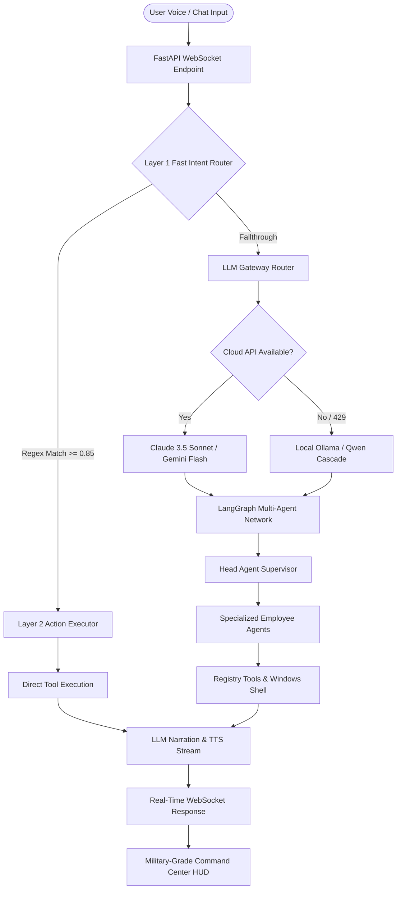

# 🧠 Dorothy OS v2.0 — Enterprise AI Operating System Command Center

> [!NOTE]
> **Dorothy (Just A Rather Very Intelligent System)** is an advanced local AI operating system designed to act as a personal command center. It integrates multi-agent orchestration, fast intent-routing, local speech-to-text, and system automation to turn high-level user commands into low-level OS operations.

---

## 🌌 Core Features

### 1. 🤖 LangGraph Multi-Agent Orchestration
Dorothy coordinates a team of 10 specialized employee agents, overseen by a centralized **Head Agent (Supervisor)**:
*   **📁 File Agent**: Performs file searching, directory listings, and file modification.
*   **⚙️ System Agent**: Controls volume, brightness, lists running processes, and fetches telemetry.
*   **🖥️ Desktop Agent**: Controls desktop window states, launches apps, and inputs keystrokes.
*   **🌐 Browser Agent**: Automates searches, executes web scraping, and manages browser automation.
*   **🔊 Voice Agent**: Handles real-time speech synthesis (Edge-TTS) and text-to-speech queues.
*   **👁️ Vision Agent**: Captures desktop screenshots, processes webcam snapshots, and runs VLM inference.
*   **🔬 Research Agent**: Queries public APIs and parses web page layouts.
*   **⚙️ Backend Agent**: Manages logs, database read/writes, and telemetry serialization.
*   **🛡️ Security Agent**: Authorizes sensitive tasks and audits cryptographic signatures.
*   **🖥️ Windows Agent**: Low-level shell/CMD scripting host with command validation.

### 2. ⚡ Layer 1 Fast Intent Routing
A zero-dependency regex engine classifying bilingual (English & Hindi/Hinglish) commands in **under 5 milliseconds**, bypassing LLM latency for standard operations.

### 3. 🔌 Dual-Mode LLM Gateway
*   **Cloud Mode**: Streams from Claude 3.5 Sonnet or Gemini 2.5 Flash (with search grounding).
*   **Local Fallback**: Automatically cascades to local Ollama (e.g., `qwen2.5:7b` / `qwen2.5:1.5b`) during internet outages or cloud API quota limit blocks (429 errors). Includes prompt-based JSON routing fallbacks for smaller models.

### 4. 🎙️ Bilingual Voice Pipeline
*   **STT**: Powered by `faster-whisper` (CTranslate2 Whisper implementation) running locally.
*   **TTS**: Integrates Azure Edge-TTS for natural neural voices (`hi-IN-SwaraNeural` and `en-IN-NeerjaNeural`).
*   **Voice HUD**: Real-time push-to-talk microphone button with instant wave visualization.

### 5. 🛡️ Security Shield & Auditing
*   **Windows Hello Integration**: Cryptographic biometrics verify identities for administrative or destructive commands.
*   **Audit Ledger**: Cryptographically hashes and records system activity to prevent unauthorized tool execution.

---

## 📐 Architecture Flow



---

## 📂 Project Structure

```text
jarvis-os/
│
├── agents/             # Specialist agent prompt schemas & behaviors
├── api/                # WebSocket managers, routers, and LLM interfaces
├── browser/            # Browser automation routines
├── configs/            # Settings, path bindings, and banned command configurations
├── data/               # Persistent data store (ignored by Git)
│   ├── audio/          # Generated TTS and recorded voice tracks
│   ├── captures/       # Screenshots and webcam scan files
│   └── dorothy.db      # SQLite memory and auditing database
├── desktop/            # PyWebView native window templates
├── memory/             # RAG working memory and vector stores
├── monitoring/         # Hardware diagnostic telemetry stream
├── orchestrator/       # LangGraph state machine, supervisor, and action executor
├── security/           # Windows Hello biometrics and audit hashing
├── tools/              # Core functions (file ops, shell script runner, hardware APIs)
├── ui/                 # HTML/CSS/JS frontend Command Center HUD
├── vision/             # OpenCV screen perception code
├── voice/              # STT and wake word processing engine
├── workflows/          # Autonomous background jobs & workflows
│
├── app.py              # Native desktop GUI entry point
├── main.py             # Uvicorn FastAPI backend server
├── requirements.txt    # Python dependencies
└── start.bat           # Desktop boot script
```

---

## ⚙️ Setup & Installation

### Prerequisites
1.  **Python 3.10+** (64-bit recommended for CUDA/STT optimization).
2.  **Ollama** installed and running locally (for offline backup).
    ```bash
    ollama pull qwen2.5:7b
    ```

### Installation Steps

1.  **Clone the Repository**:
    ```bash
    git clone https://github.com/Sachindrapandeyyy/dorothy-multiagent-system-.git
    cd dorothy-multiagent-system-
    ```

2.  **Setup Environment Variables**:
    Create a `.env` file in the root directory:
    ```ini
    GEMINI_API_KEY=your_gemini_api_key_here
    ANTHROPIC_API_KEY=your_anthropic_api_key_here
    OLLAMA_MODEL=qwen2.5:7b
    OLLAMA_BASE_URL=http://localhost:11434
    ```

3.  **Boot the Application**:
    Double-click **`start.bat`** or run:
    ```bash
    python -m venv venv
    venv\Scripts\activate
    pip install -r requirements.txt
    python main.py
    ```

4.  **Access the Command Center**:
    Open [http://localhost:8000](http://localhost:8000) in your browser or run `app.py` for a native frameless desktop app container.

---

> [!WARNING]
> **Safety Notice**: Dorothy OS prevents execution of destructive commands (such as formatting drives or force deleting root folders) listed in the `BLOCKED_COMMANDS` configuration inside `configs/settings.py` to protect system integrity.
